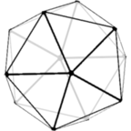

# FullWeb.dev

</img>

<b>A transverse vision of modern web development</b>

##

## About

> :construction: WIP

## License

© Copyright 2020 [Noël Macé](mailto:contact@noelmace.com)

### Docs

 Except as otherwise noted, all documentation is licensed under a <a rel="license" href="http://creativecommons.org/licenses/by-sa/4.0/">Creative Commons Attribution-ShareAlike 4.0 International License</a>.

### Code

Except as otherwise notes, all code (including code samples) is licensed under a [MIT license](./LICENSE).
