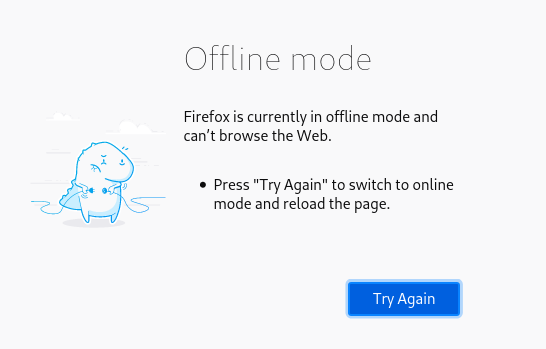
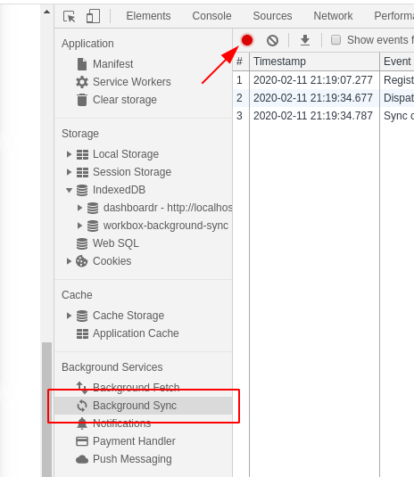
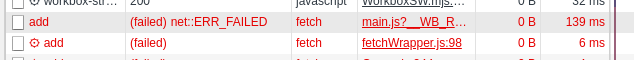
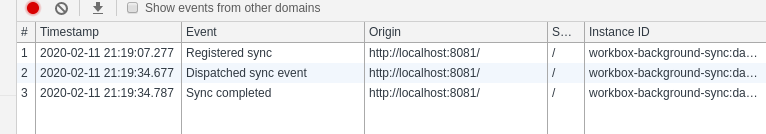
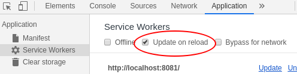

# PWA orientée données et capacités modernes

## Introduction

Durant ce codelab, vous créerez une application Web progressive disponible hors-ligne, orientée données, et dotée de capacités modernes de pointe.

### Sujets traités

* Comment utiliser la synchronisation en arrière-plan (background sync) pour mettre à jour l'application, même lorsque celle-ci n'est pas affichée.

### Pré-requis

Ce codelab requiert que vous soyez déjà familier avec les éléments de base du développement Web.

En particulier, il est recommandé d'avoir une certaine maîtrise d'HTML, de CSS et de JavaScript (i.e. ES2019),
et d'avoir au moins une fois contribué au développement d'une Web App (peu importe le framework ou la librairie utilisé).

### IMPORTANT

<aside class="warning">
  <b>Dans le cas où vous assistiez à une version "live" de ce codelab (durant une conférence, comme le Devfest Paris 2020 par exemple), il vous est fortement recommandé d'effectuer les étapes 2 et 3 (installations) en amont !</b>
</aside>

### Logiciels indispensables

* Un IDE / un éditeur de code ou de texte
  * recommandation : [Download Visual Studio Code](https://code.visualstudio.com/)
* La dernière version de Chrome
  * [Chrome Canary](https://www.google.com/chrome/canary/)
  * ou [Chome Dev](https://www.google.com/chrome/dev/) si vous ne pouvez install la version Canary (eg sur Linux)
  * (optionnel, en supplément) [Firefox](https://www.mozilla.org/fr/firefox/channel/desktop/#nightly) Nightly ou Developer Edition
* [Node.js](https://nodejs.org/en/) et [npm](https://www.npmjs.com/)

### Recommandations

<aside class="notice">
  Ces éléments sont nécessaires pour tester plusieurs fonctionnalités que vous ajouterez à la PWA. Ils ne sont pas absolument indispensables pour compléter ce codelab, mais très fortement recommandés.
</aside>

* un système Windows ou Mac OS X
  * si vous utilisez Linux, vous pourrez au besoin utiliser une [VM](https://developer.microsoft.com/en-us/windows/downloads/virtual-machines/), mais vous devrez également y installer la dernière version de Chrome (cf. plus haut), et vous assurer que celle-ci peut accéder au système hôte via un réseau virtuel (HTTP)
* un smartphone Android "récent" avec Chrome, [Chrome Canary](https://play.google.com/store/apps/details?id=com.chrome.canary&hl=en), [Firefox Nightly](https://play.google.com/store/apps/details?id=org.mozilla.fennec_aurora&hl=en_US), et un cable usb

## Mise en place

### Projet

Clonez le code de démarrage depuis GitHub via la commande suivante :

```bash
git clone https://github.com/noelmace/data-driven-pwa.git
```

Vous pouvez également le télécharger au format zip [en cliquant ici](https://github.com/noelmace/data-driven-pwa/archive/master.zip).

### Dépendances

Rendez-vous à la racine du projet via la commande :

```bash
cd data-driven-pwa
```

Installez ensuite les dépendances du projet en lançant la commande suivante :

```bash
npm install
```

<aside class="special">
  Cette commande lance l'installation des outils de développement depuis la racine du dépôt, incluant [Lerna](https://lerna.js.org/). Ce dernier est ensuite utilisé pour également installer les dépendances de tous les sous-projets, à partir desquels vous effectuerez les étapes suivantes. Par concéquent, <b>il ne vous sera pas nécessaire d'effectuer un `npm install` pour chacun de ces projets</b>.
</aside>

## Premier contact avec l'application

Via le terminal, rendez-vous dans le dossier "project" où se situent les éléments de base du projet :

```bash
cd project
```

À partir de ce dossier, démarrez le serveur de développement pour pouvoir utiliser et tester l'application :

```bash
npm run --silent start
```

Ouvrez l'application en entrant l'url [localhost:8081](http://localhost:8081) dans votre navigateur web.

L'application vous demande alors une autorisation pour pouvoir afficher des notifications. Cliquez sur "Autoriser" ou "Allow" pour l'accepter.

 \
_Crédit image: ©️ Google Inc._

<aside class="special">
  Cette application est issue d'un codelab de Google intitulé <a href="https://codelabs.developers.google.com/codelabs/workbox-indexeddb/#2" target="_blank" rel="noopener noreferrer"><i>Build an offline-first, data-driven PWA</i></a>.
</aside>

## Une application orientée données

Retournez à la racine du projet, et lancez la commande permettant de modifier automatiquement le code pour ce chapitre :

```bash
cd ..
npm run goto --step=4
```

<aside class="special">
  <p>Cette même commande permet également de "sauter"/corriger tous les chapitres suivants. Il est cependant indispensable de les lancer avant toute modification du code du projet, dans l'ordre, en commençant par 4.</p>
</aside>

Étant donné que cette commande modifie, pour cette étape, la configuration de build, vous devez également stopper (`Ctrl+C`) le serveur et le relancer :

```bash
cd project
npm run --silent start
```

Retournez dans le navigateur, et mettez à jour l'application :

1. Rafraîchissez la page dans Chrome (`Ctrl+Maj+R`)
2. Ouvrez les Developer Tools (`Ctrl+Maj+i`)
3. Sélectionnez la section _Service Workers_
4. Activez le nouveau service worker en cliquant sur `skipWaiting`
5. Enfin, rafraîchissez la page à nouveau

<aside class="tip">
  Notez bien ces étapes. Vous devrez les reproduire souvent par la suite.
</aside>

Enfin, stoppez le serveur pour simuler une coupure réseau, puis rechargez l'application dans le navigateur. Vous constaterez alors que l'application semble fonctionner à l'identique.

Dans les developer tools de Chrome, sélectionnez la section _IndexedDB_, puis la base de donnée _dashboardr_. Celle-ci permet de stocker localement les "évènements" pour une consultation hors ligne.

L'application dont vous disposez à présent est bien une PWA entièrement disponible hors-ligne !

### Explication

Sans développement spécifique, quand un utilisateur tente d'accéder à une Web App en étant déconnecté, un message "Offline" est affiché, empéchant toute utilisation de l'application.

<p class="center">
  
</p>

Workbox a permis, en mettant en cache le App Shell, de ne jamais montrer ce type de message à un utilisateur retournant sur l'application.

Mais une application n'est rien sans données !
Nous avons donc utilisé IndexDB pour mettre ces données en cache (ici, des "events"), et permettre de les consulter même en étant hors-ligne.

Un problème persiste cependant : comme le serveur n'est bien évidemment pas disponible quand l'utilisateur est hors ligne, tous les "events" qu'il aura alors créé n'auront été stockés que localement. Ils seront donc perdus très rapidement !

Nous allons dans le chapitre suivant résoudre ce problème via workbox-background-sync, et donc la Background Sync API.

### Pas-à-pas (optionnel)

Vous pouvez également suivre les <a href="https://codelabs.developers.google.com/codelabs/workbox-indexeddb/#3" target="_blank" rel="noopener noreferrer">étapes 4 à 7 du codelab Google</a> pour mieux comprendre en détails ces fonctionnalités.

Pour gagner du temps, les "step" correspondant ont été créés pour la commande "goto". Leurs numéros suivent le format `4-<step google>` :

```bash
npm run goto --step=4-4
npm run goto --step=4-5
npm run goto --step=4-6
npm run goto --step=4-7
```

<aside class="warning">
  Si vous décidez d'écrire ce code vous même, assurez vous d'utiliser la dernière version de Workbox (5.0.0) au lieu de celle indiquée dans le premier code d'exemple (3.5.0).
</aside>

```javascript
importScripts('https://storage.googleapis.com/workbox-cdn/releases/5.0.0/workbox-sw.js');
```

## Ne pas perdre de données hors-ligne

### Compatibilité des navigateurs

La [BackgroundSync API](https://wicg.github.io/BackgroundSync/spec/) est toujours à ce jour à l'état de Draft.
Par conséquent, même si [Firefox souhaite l'implémenter depuis longtemps](https://groups.google.com/forum/#!msg/mozilla.dev.platform/cTAnBeZFtUE/kx0I4UC-AQAJ), celle-ci n'est pour l'heure supportée que par [Chrome](https://www.chromestatus.com/feature/6170807885627392) et [Opera](https://developer.mozilla.org/en-US/docs/Web/API/ServiceWorkerRegistration/sync#Browser_compatibility).

Fort heureusement, nous allons implémenter cette fonctionnalité via Workbox, qui intègre une [stratégie de fallback](https://developers.google.com/web/tools/workbox/modules/workbox-background-sync#adding_a_request_to_the_queue) :
à chaque fois que le service worker sera à nouveau démarré, celui-ci rejouera tous les appels qui n'ont pu aboutir jusque là, et ont donc été mis en attente.

Cela est bien entendu moins efficace (car l'application doit être active pour se faire), mais résout la plupart des problèmes de compatibilité.

### Mise en place du Background Sync

Ajoutez le code suivant dans **app/sw.js** juste en dessous de `precacheAndRoute` :

```javascript
const { BackgroundSyncPlugin } = workbox.backgroundSync;
const { registerRoute } = workbox.routing;
const { NetworkOnly } = workbox.strategies;

const bgSyncPlugin = new BackgroundSyncPlugin('dashboardr-queue');

const networkWithBackgroundSync = new NetworkOnly({
  plugins: [bgSyncPlugin]
});

registerRoute(/\/api\/add/, networkWithBackgroundSync, 'POST');
```

Enregistrez le fichier, et relancez le serveur :

```bash
npm run --silent start
```

### Tester l'application

Pour voir le résultat de cette nouvelle fonctionnalité, effectuez une nouvelle mise à jour de l'application (refresh - skipWaiting - refresh) et stopper le serveur.

Déconnectez votre ordinateur du réseau **pour de vrais** (wifi et cable).

<aside class="warning">
  Le background sync se basant sur le <i>véritable</i> statut de la connection réseau de votre système, il est indispensable d'activer et désactiver votre ordinateur pour ce chapitre et le suivant. <b>Le trottling via les DevTools et l'arrêt de serveur ne suffiront pas.</b>
</aside>

Dans `Developer Tools > Background Sync`, démarrez la capture des évènements Background Sync.



Créer un nouvel 'event' via le formulaire en bas de l'application.

En allant à l'onglet 'Network' des devtools, vous pourrez constater qu'une requête vers `/api/add` a échouée.



Dans le même temps, une nouvelle base `workbox-background-sync` a été créée, contenant une request vers `http://localhost:8081/api/add` (`requestData.url`) (cf. `Developer Tools > Application > IndexedDB`) et un évènement "Registered Sync" est visible dans "Background Sync".

<aside class="notice">
  Pensez à rafraîchir IndexedDB (click droit) si rien n'apparaît.
</aside>

Enfin, il est temps de repasser en ligne :

1. Relancez le serveur

```bash
npm run --silent start
```

2. Une fois le serveur pleinement disponible, rétablissez la connexion de votre machine.

De nouveaux évènements Background Sync sont à présent visible dans les devtools.



Cela a permis à votre service worker de retenter l'appel à `/api/add`, avec succès cette fois, comme indiqué dans "Networks".

Bien entendu, la requête à du même coup été supprimée de la base IndexedDB.

Enfin, rechargez la page : vous constaterez que votre nouvel évènement a bien été enregistré, et est donc toujours présent.

<aside class="special">
  Vos nouveaux évènements ont même été enregistrés par le serveur dans <code>server-data/events.json</code>.
</aside>

<aside class="warning">
  Le background sync sous Chrome <a href="https://github.com/GoogleChrome/workbox/issues/1896">peut parfois être capricieux</a>. Si un "Registered Sync" n'apparait pas après que vous ayez créé votre évènement, il s'agit sans doute d'un bug indépendant de l'application. Fermez complètement Chrome (y compris les processus en arrière plan), redémarrez le, et retentez l'opération après avoir supprimé toutes les données de l'application (Clear Storage > Clear site data).
</aside>

## Informer l'utilisateur de l'enregistement

La potentialité d'une perte de données est toujours source de stress pour vos utilisateurs. _Votre serviteur en sait quelque chose, étant donné qu'il écrit actuellement ce chapitre pour la seconde fois, suite à un git checkout malencontreux 😓. Ironique n'est-ce pas ?_

C'est pourquoi il est indispensable de prendre en compte l'intégralité de leur parcours, de la création de données hors ligne (et donc, leur stockage localement) à l'enregistrement de celles ci côté serveur une fois la connexion retrouvée.

<aside class="warning">
  Notez bien que sans l'usage des outils de développement et l'accès au serveur, vous auriez été bien incapable de dire, à l'étape précédente, si vos évènements avaient bien été enregistrés.
</aside>

Ici, notre application est plutôt sommaire. Nous nous contenterons donc d'informer l'utisateur de l'enregistrement de ces données via une notification.

### Afficher une notification

Ajoutez le code suivant à **app/sw.js** :

```javascript
const showNotification = () => {
  self.registration.showNotification('Background sync success!', {
    body: '🎉`🎉`🎉`'
  });
};
```

Comme son nom l'indique, cette fonction fait usage de la Notification API pour afficher une notification "système". Rien de plus.

Pour y faire appel à la reception d'un sync event, ajoutez une option `onSync` à notre BackgroundSyncPlugin, comme suit :

```javascript
const bgSyncPlugin = new BackgroundSyncPlugin('dashboardr-queue', {
  onSync: showNotification
});
```

### Tester l'application

Répétez maintenant les mêmes opérations qu'à l'étape précédente. Rechargez l'application, activez le service worker via un skipInstall, rechargez à nouveau, puis passez hors (en coupant le serveur et la connection réseau de votre machine). Vous pouvez à présent créer un nouvel évènement.

Réactivez votre connection (serveur, puis machine). Vous verrez alors apparaître la notification.

Mais il semblerait que nous ayons créé une notification trompeuse. Votre évènement n'a pas été enregistré ! Explorez les devtools pour vous en assurer.

### Explication

Par défaut, un BackgroundSyncPlugin a un comportement des plus simple. Il créé un file (queue) par défaut, stocke toutes les appels correspondant à la route à laquelle il a été associé dans celle-ci quand ils échouent, et les rejouent tous à la reception d'un sync event.

Mais l'option `onSync` n'a pas vocation à n'être qu'une simple callback en adition de ce comportement. Elle le remplace.

Ainsi, quand nous avons associé `showNotification` au `onSync` du plugin, nous n'avons pas ajouté un comportement.
Nous l'avons remplacé.

### Customiser le comportement de Workbox

Pour réparer cette erreur, nous devons reproduire le comportement par défaut du plugin, et donc rejouer tous les appels dans sa file.

Editez `showNotification` pour obtenir le résultat suivant :

```javascript
const showNotification = ({ queue }) => {
  queue.replayRequests();
  self.registration.showNotification('Background sync success!', {
    body: '🎉`🎉`🎉`'
  });
};
```

Enfin, ré-effectuez le test de l'application précédent, et gardez un œil sur la console et "Network". Votre appel POST sur /api/add sera cette fois-ci rejoué correctement une fois la connexion retrouvée, et votre évènement bien enregistré.

## Se débarasser de la mini info-bar

Nous avons implémenté des fonctionnalités qui répondent aux besoins de nos utilisateurs, dans une application performante, et avec une UX qui corresponde à leurs attentes.

À présent que nous pouvons donc être confiant dans le succès de notre app ( 🤷‍ ), notre priorité devient la fidélisation de la foule d'utilisateurs qui ne va pas manquer de l'utiliser.

Pour se faire, rien de mieux, techniquement, que l'installation (ou A2HS, pour Add to Home Screen).

Afin d'encourager l'installation des Web Apps, une première solution apportée par Chrome for Android est la mini info-bar.


_image credit: CC BY 4.0 ©️ Google_

Malheureusement, cette [mini info-bar](https://developers.google.com/web/fundamentals/app-install-banners/native) rebute bien plus le grand public qu'elle n'incite à l'installation.
Il va donc être primordial pour nous de l'éviter à tout prix.

<aside class="tip">
  <p>
    Pour tester l'affichage de la mini-infobar, vous aurez besoin de charger la web app sur Chrome Android, en HTTPS ou localhost. La solution la plus simple consiste à <a href="https://developers.google.com/web/tools/chrome-devtools/remote-debugging/local-server">utiliser la redirection de port de Chrome</a>.
  </p>
</aside>

Dans **app/main.js**, ajouter le code suivant dans le `if('serviceWorker in navigator)` :

```javascript
let deferredPrompt;

window.addEventListener('beforeinstallprompt', e => {
  console.log('beforeInstallPrompt event detected');
  e.preventDefault();
  deferredPrompt = e;
  console.log('ready for A2HS');
});
```

Mettez à jour votre application, et observez la console.

<aside class="notice">
  <p>
    Pour les chapitres comme ceux-ci, où vous apporterez pas ou peu de modification au service-worker `sw.js`, mais aurez besoin de mettre à jour l'html et le javascript du window context régulièrement, il peut être plus pratique de recharger toute l'application à chaque rafraîchissement de la page, et donc d'éviter tout cache.
  </p>
  <p>
    Pour cela, vous pouvez activer l'option "Update on reload" pour recharger un service worker complet à chaque fois :
  </p>
  <p class="center">
    
  </p>
</aside>

## Encourager l'installation de l'application

```html
<li>
  <button class="button ripple" id="install-btn" style="display: none">Install</button>
</li>
```

```javascript
const btnAdd = document.getElementById('install-btn');

function showInstallPromotion() {
  btnAdd.style.display = 'inline-block';
}
```

```javascript
window.addEventListener('beforeinstallprompt', e => {
  console.log('beforeInstallPrompt event detected');
  e.preventDefault();
  deferredPrompt = e;
  showInstallPromotion();
});
```

```javascript
btnAdd.addEventListener('click', e => {
  btnAdd.style.display = 'none';
  deferredPrompt.prompt();
  deferredPrompt.userChoice.then(choiceResult => {
    if (choiceResult.outcome === 'accepted') {
      console.log('User accepted the A2HS prompt');
    } else {
      console.log('User dismissed the A2HS prompt');
    }
    deferredPrompt = null;
  });
});
```
