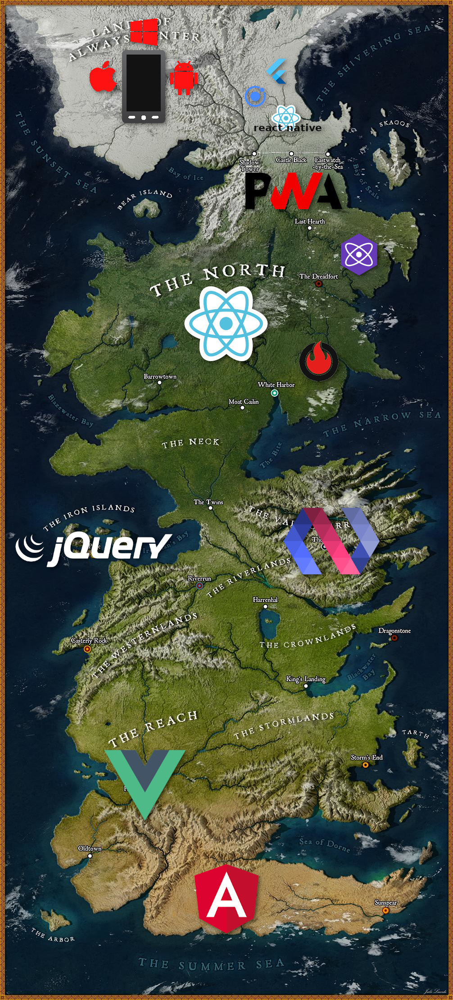
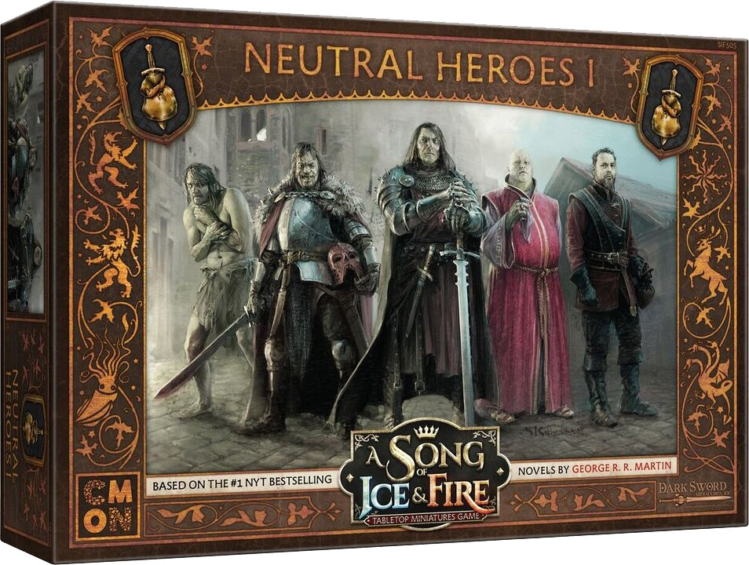
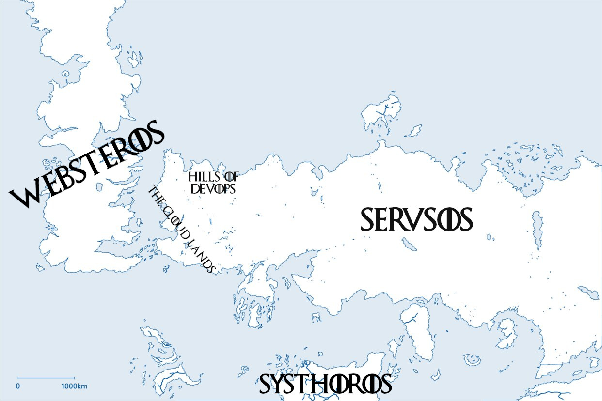
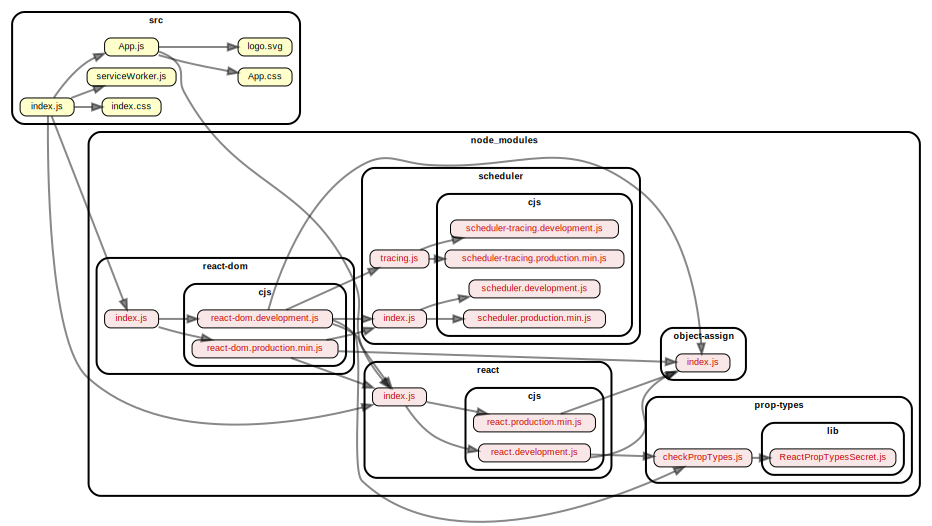
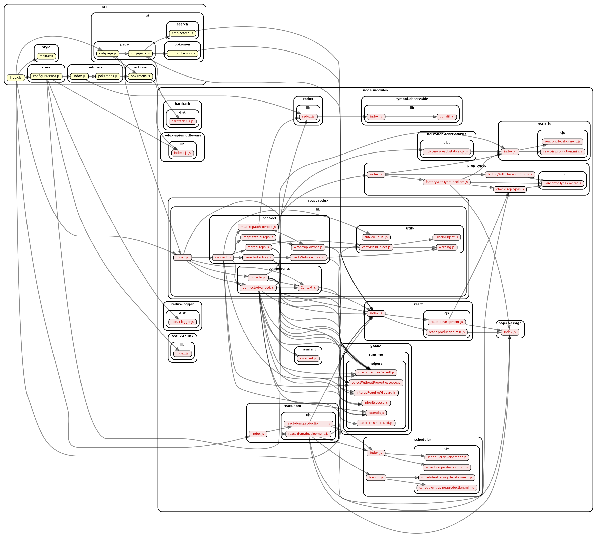
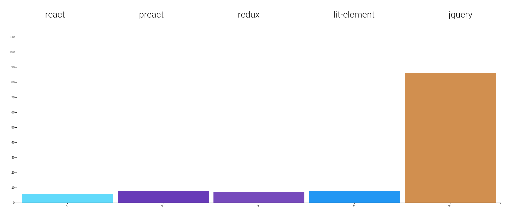
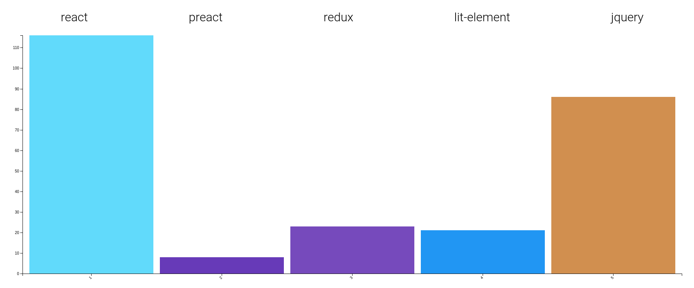
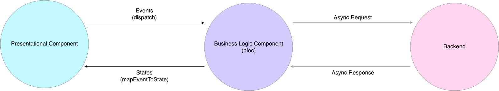
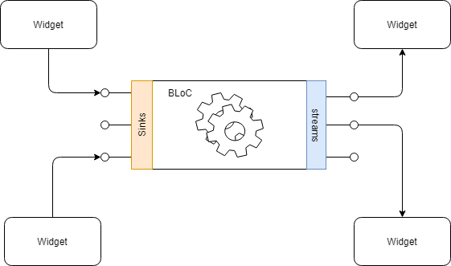

# Brace yourself, Vanilla is coming ... back!

<!-- markdownlint-disable no-bare-urls -->

## Welcome to Websteros!

Today, I'll tell you the story of our land. Why
our kingdoms exists. Why there is peace, war and
alliances between them.

Especially, I'll tell you the story of our
unaligned and free company!

So, let's start with our land and the kingdoms
which splits it into pieces.



### The Sunny Lands

Here, the life looks easy from the
outside. And it can be!

But don't fool yourself. It can also
become a deadly trap if you don't watch
yourself.

### The Isolated Lands

Something went wrong here!

The **JQuery** Kingdom has been isolated on its islands
for too long, and they don't understand
this world anymore!

Unfortunately, they continue to attack us
from time to time. But for the most of
it, we can ignore them.

**Polymerians** came close to live the same destiny as
JQuerians. Yet, recently, the council
chose to challenge their rules. It saved
the kingdom!

### The reactive north

Those people have their own rules and
gods!

Yet, they stay open to the other
kingdoms, and are pretty efficient.

### Behind the Web

Behind a wall kept by the PWA watch, hides a great danger: the native
walkers! They don't know how to work
together!

This could be the end of Websteros!

Yet, some people from the web lands are
helping to preserve the peace with those
strangers ... whom, after all, are just
like us, but with different goals.

There is still some battles between this
kingdoms. Yet, we manage to have peace. But we
need to preserve it!



**This is our goal!**

We, the unaligned, neutral people, may love some
kingdoms more than some others.

Yet, we love them and avoid them all at the same
time.

We are the vanilla people!
There is a lot of ways to join us!

<!-- TODO: more details about the definition of "Vanilla" -->
<!-- TODO: about PWA -->

Yet, today, in order to keep it simple, I will
mainly speak about the most famous of our
tribes: the Web Components!

Because there was too many wrong things said
about them!

So, for those who come from SysthoryOS, here is
a quick reminder.

>  > _Yeah, because here we care about WebSteros, but there is other lands beyond the seas, remember?!_

## Web Components: quick reminder

###  Custom Elements

> **_TODO_**

###  Shadow DOM

> **_TODO_**

###  ES Modules

> **_TODO_**

###  HTML Templates

> **_TODO_**

## Explaining the power of the Kingdoms

But before we talk about that in more details, let's go back to our Kingdoms.

There is two kinds of them: Frameworks & Libraries.

Why are they here? Why are they so important?

Let's get to the roots of these questions.

### Frameworks

When talking about frameworks, the first ones which come to mind are the big Kingdoms of the Sunny Lands: Angular & Vue.

They are self sufficient, and very powerful.

Yet, there is some smaller kingdoms which you
should also know. Those follow the rules of bigger Kingdoms, like
React (for Gatsby & NextJs), or Vue (for Nuxt). Being small or big, the question remain:

**Why some of our people are following them?**

Most of us will say that this is because with
them, you're going faster! And these is true ... at first!

#### Opinionated approaches

You see, this kingdoms have stronger opinions
than the others. The rules are more strict, and people have less
freedom. Don't get me wrong: this is for the best! Because an opinionated approach brings order, which leads to efficiency.
But too strong opinions can lead to dictatorship and... prison.

See, when a framework is born, all opinions have
to be right, or it quickly die. But the stronger are these opinions,
and the most time go by, the more inaccurate (or even, wrong)
they can get. And the more challenging it
becomes to change them.

Then, what was liberty become a (beautiful) sky cell!


Challenging this opinions, and making the
required changes, take time. This is the main
reason why you are going faster: you are
creating a technical debt.

But that's ok, because most frameworks will help
you with that!

Yet, remember: **a WebDev always pay is debts!**

> Talking about "technical debt", you may think by now that I encourage you to drop all Web Frameworks for good. I'm not (at all)!
>
> I use here the word "debt" in order to be easily understood - and to make a "Lanister" pun of course.
> Yet, "another kind of investment" would be better here.
>
> About that, you should absolutely read
> [La dette technique: une supercherie mythologique pour galériens de l’IT](https://medium.com/@waxzce/la-dette-technique-une-supercherie-mythologique-pour-gal%C3%A9riens-de-lit-7ed0dfbf39c7) by Quentin Adam, Clever Cloud CEO. It's in french, but I think an english version should be published soon.
>
> See [our discussion on Twitter](https://twitter.com/noel_mace/status/1177934427470651394) for some context.

#### "it's easier"

There is also one misconception about frameworks
you should care about: people think using a
frameworks can solve everything! They couldn't
be more wrong!

Because:

1. they require to perfectly know those
   opinions
2. they do NOT covers
   **all** opinions

This is why, for complex projects, you HAVE to
only use a framework you perfectly know! You'll
need to invest a lot in it specifically,
especially for technical watch.

> This is especially why so many companies need to hire senior Angular consultants (like me for example :wink:) for audits & teaching.

#### Should we kill the frameworks then?

No, of course!

When you need to quickly deliver a project, and
don't have to make a lot of changes after a
small period, go for it! Frameworks are what you
need!

This is why I love Angular so much. This
definition covers most projects who needs
consultants and trainings.

This is also why I love Gatsby! I think I
created one project using Gatsby each month of
these year, in just a few days, just to let them
become legacy after that.

> One last thing about frameworks: **don't let your company create its own framework just to "speed up" your projects!**
>
> **It won't, trust me!** (Except if your company is a "big player" like Google or React of course)
>
> Create an **Open Source** framework in order to help the community, and learn! That it!
> Who knows, maybe it will become useful and loved, like VueJS.

Another good example, in my opinion, of a useful "framework" for "vanilla" WebDev is _Open Web Components_.
Give it a try, you won't regret it!

Ok so, now that we're done with frameworks, let's talk about:

### Libraries

#### Let's talk about React

Of course, after frameworks, w/ VueJS and
Angular, the first "library" we have to talk
about here is React! We already saw that "React Frameworks" exists,
e.g. Gatsby or NextJS. Some may need those
because React itself is, indeed, just a library.

It only deals with one thing: rendering. With a
strongly opinionated "functional" & "one
direction dataflow" approach.

And it's not (only) about the Web Platform.
The Web Platform is just one platform!

React can address others, like:

- server, for SSR (react-dom/server)
- Mobile (react-native)
- Desktop (proton-native)
- CLI (ink)
- emails (oy)
- documents (reactpdf, redocx)
- Even IoT & robotic 🤯 (react-hardware)

> Go check [awesome-react-renderer](https://github.com/chentsulin/awesome-react-renderer) for more examples.

This justify, of course, abstractions on top of
the Web Platform. _BTW, it's the same with Angular, or even Ionic._

**"Vanilla" is the opposite!** It's about embracing
**one** platform in order to use it at its full power!

In order to illustrate that, let see what we got if we just create a blank react app using create-react-app...

```bash
npx create-react-app my-app
```

...and generate its dependency graph using dependency-cruiser...

```bash
cd my-app
npm i -g dependency-cruiser
depcruise --exclude "App.test.js" --output-type dot src | dot -T svg > dependencygraph.svg
```



So yeah, of course, when using React when
developing a web app, you need a web renderer!
React-dom being the by default choice.

**The React package isn't self sufficient!**

React having a strong "philosophy", it also leads most project to fully embrace it! But it's not mandatory!

Again, let's generate the dependency graph of a React project ... but a real one this time. Here, [pokedex](https://github.com/alik0211/pokedex).



Here, we see that this project use Redux (which isn't specific to React, yet, mostly used with it) and
Hardtack (a micro-library for cookies management which have nothing to do with React).
No react-router-dom, react-intl, react-pose, etc...

Because there kind of is two sides to "React":

- a rich ecosystem for multi-platform/complex UI development
- a (sometime) useful rendering library

You can (and should) do way more "Vanilla" using React than Angular or Vue.
That doesn't mean it's better or worst. It's just different.

Even if the way React see "Components" is far from the "Web Components" standards, both can work pretty well together.
It just need some tricks.

Here is an example using a Web Component inside a React component:

https://github.com/fullwebdev/fullwebdev/blob/master/packages/slides/vanilla-1/src/assets/code-samples/wc-in-react.js

> Using a complex web component inside a React App still need a bunch of boilerplate code.
> The community is discussing some solutions of that since 2016:
>
> - [Attributes and properties for Custom Components #7249](https://github.com/facebook/react/issues/7249)
> - [Bypass synthetic event system for Web Component events #7901](https://github.com/facebook/react/issues/7901)

And as React is a rendering library, you can even use it inside your Web Components in order to handle the rendering. Here is an example from the documentation:

https://github.com/fullwebdev/fullwebdev/blob/master/packages/slides/vanilla-1/src/assets/code-samples/react-in-wc.js

Here, we're using the standard HTMLElement...

https://github.com/fullwebdev/fullwebdev/blob/master/packages/slides/vanilla-1/src/assets/code-samples/react-in-wc.js#L1

...and use customElement.define...

https://github.com/fullwebdev/fullwebdev/blob/master/packages/slides/vanilla-1/src/assets/code-samples/react-in-wc.js#L12

...like every Custom Element.

And we use the standard in order to attach a shadow root.

https://github.com/fullwebdev/fullwebdev/blob/master/packages/slides/vanilla-1/src/assets/code-samples/react-in-wc.js#L4

Finally, we can use React to render the template.

https://github.com/fullwebdev/fullwebdev/blob/master/packages/slides/vanilla-1/src/assets/code-samples/react-in-wc.js#L9

Does those make React a "Vanilla" library? Let's see...

#### How to decide if you should use a library

When adopting a "Vanilla" approach, the first question you need to ask yourself is:

:question: **Is it related to a Web Platform concern?**

In other words:

- Is it close to any existing standards?
- Is it adding an unnecessary abstraction on top of it?
- Will you be able to replace it easily?

:question: **Is it heavy?**

Would this library add too much JS to load?

Never forget about the [cost of JS](https://v8.dev/blog/cost-of-javascript-2019).

Here (comparing apples & pears) are the weights of the libraries we talked about earlier (minified but not compressed, in kB):



**It's a trap!**

Here are the real weights, including, respectively :

- react-dom
- (nothing)
- react-redux
- lit-html
- (nothing)



React illustrate the fact that a "small" library
can hide really heavy and complex dependencies
(here react-dom). See how it compares with Preact now!

It's the same with Redux: even if you don't have to use react-redux (the same goes with react-dom),
you'll need to write something similar, adding more work, and more JS to load anyway.

Lit-element is, IMO, a good example of a light
library: it only relies on a really small
dependency, lit-html.

And finally, we have JQuery, leading us to the next question (behold, troll ahead)...

:question: **Is it useful?**


I can't see any example where you could say
"yes" to that question when it comes to JQuery,
given the evolutions of the Web Platform.
This isn't new! And this is why most big
companies (like, for example,
[Github](https://github.blog/2018-09-06-removing-jquery-from-github-frontend/)
or
[Clever Cloud](https://youtu.be/uFxVH5mFAKg)) did or are still making an effort to move
away from JQuery.

This is yet another good example of why adding
an abstraction over the Web Platform can be a
good choice at some time, but which needs to be
regularly challenged.

### Should we kill the web libraries then?

So, should we avoid all libraries?

Of course not! Even if the standardization
process goes way faster now, the Web Platform
will always have its limitations.

In its time, JQuery was answering the lack of a
good DOM manipulation API. The fact that
querySelector and other things made it obsolete
doesn't make it retrospectively useless! It only
means that you need to prepare yourself to drop
any library you're using any time soon!

Just don't let the libraries you use "drive" your project, that it!

For example, you can use lit-html or even
lit-element. It will add some opinionated
abstractions on top of your Web Components, but it's
simple and light enough to permit to get rid of it
pretty easily if you need to.

The same goes with tooling (e.g. stencil, reasonml, typescript, etc...).

## So, what can we do with VanillaJS now?

### K.I.S.S.

When embracing the "Vanilla Web" approach, there is one principle you have to follow above all: _Y.A.G.N.I._!
Do you really need to write this abstraction/utility right now? Are you sure you'll use it in the short term? No?

**_Then don't to it! Keep It Simple, Stupid!_**

When you're used to Angular, Vue or React, it's pretty easy to think, for example, that you'll always need a router!
Guess what? Lots of apps don't! Vanilla approach makes you free!
You can think your SPA and rendering in another, more specific way.
Or maybe you even don't need to show different routes at all!

Yet, stay modest and careful: there is always a reason behind the fact that pretty much everyone is doing the same thing.
Don't fool yourself thinking you can re-invent the wheel and do better than people at Google or Facebook,
and/or a mature and wide community.

### Routing

You could use for example the minimalist helpers the Polymer project provides: [PWA Helpers](https://github.com/Polymer/pwa-helpers).

It includes the "router.js" utility, which only weights 589 bytes once minified!

https://github.com/fullwebdev/fullwebdev/blob/master/packages/slides/vanilla-1/src/assets/code-samples/pwa-helpers-routing.js

You can find an example in https://github.com/noelmace/prpl-demo/tree/master/common/app (using Redux, lit-element & pwa-helpers).

Of course, if you wanna go "full vanilla", you can simply use the History API, but beware:
calling history.pushState() or history.replaceState() won't trigger a popstate event on Firefox.
Meaning that you'll have to write your own routing events system.

### Server Side Rendering

One common misconception about Web Components is that they can't be compatible with SSR.

There is only two reasons why you may want to do SSR:

- for SEO
- for performance

While any vanilla web app (including with web components) can be rendered server side,
[using Chrome Headless / Puppeteer](https://developers.google.com/web/tools/puppeteer/articles/ssr),
there is really few chances you actually need it.

Go check [Myth: Web Components Can't be Server-Side-Rendered](https://dev.to/bennypowers/lets-build-web-components-part-8-mythbusters-edition-3la#myth-web-components-cant-be-serversiderendered) by @bennypowers, and [Server Side Rendering Web Components](https://koukia.ca/server-side-rendering-web-components-fc99715e38f5) by Aram Koukia for more information.

And (if you understand french), check out my last talk about [P.R.P.L.](https://www.youtube.com/watch?v=YSn8r0BDKTY).
It's often a better choice than SSR for performance.

### Interactions with WC

Remember: Web Components are all about reusability.
Nobody said that you have too use all the related features/standards for every part of your app!

#### Custom Element = reusability through HTML

You only need to use this component once, in your app? Then just write a function for that.

#### Shadow DOM = styling isolation (reusability, again)

If your components is used only in a context where you have full control of styling,
there is other ways to guaranty a good maintainability and readability.

#### ES Modules = lazy loading and independence (reusability, again)

If your component is always related to another one, write it in the same es module (ie file).

In all cases, there are good practices you should follow when writing your own Web Components!

Here are those related to interactions:

- [Always accept primitive data (strings, numbers, booleans) as either attributes or properties.](https://developers.google.com/web/fundamentals/web-components/best-practices#always-accept-primitive-data-strings,-numbers,-booleans-as-either-attributes-or-properties.)
- [Aim to keep primitive data attributes and properties in sync, reflecting from property to attribute, and vice versa](https://developers.google.com/web/fundamentals/web-components/best-practices#aim-to-keep-primitive-data-attributes-and-properties-in-sync,-reflecting-from-property-to-attribute,-and-vice-versa.)
- [Aim to only accept rich data (objects, arrays) as properties.](https://developers.google.com/web/fundamentals/web-components/best-practices#aim-to-only-accept-rich-data-objects,-arrays-as-properties.)
- [Do not reflect rich data properties to attributes.](https://developers.google.com/web/fundamentals/web-components/best-practices#do-not-reflect-rich-data-properties-to-attributes.)
- [Do not self-apply classes.](https://developers.google.com/web/fundamentals/web-components/best-practices#do-not-self-apply-classes.)
- [Dispatch events in response to internal component activity.](https://developers.google.com/web/fundamentals/web-components/best-practices#dispatch-events-in-response-to-internal-component-activity.)
- [Do not dispatch events in response to the host setting a property (downward data flow).](https://developers.google.com/web/fundamentals/web-components/best-practices#do-not-dispatch-events-in-response-to-the-host-setting-a-property-downward-data-flow.)

And the related spec you should absolutely read:

- [WHATWG - 2.7.1 Reflecting content attributes in IDL attributes](https://html.spec.whatwg.org/multipage/common-dom-interfaces.html#reflecting-content-attributes-in-idl-attributes)

### State Management: Big BLoC vs Reusability

Talking about Web App State Management often means talking about variations around MVVM.
Defining business logic outside the View, for one page, or one app module (ie for several components).

Google introduced (for flutter & AngularDart) a trendier term for that in 2018: the BLoC pattern.
My purpose here is just to introduce the idea to you in a "Vanilla" context, not to give you the full details.
Basically, you could think "reactive MVVM" :wink: It's kind of similar to most State Management approaches like Redux.



You could write a BLoC like a ViewModel with VanillaJS.

https://github.com/fullwebdev/fullwebdev/blob/master/packages/slides/vanilla-1/src/assets/code-samples/bloc/bloc-class.js

Yet, we would miss the point doing so. Using Dart, implementing the BLoC pattern relies on Dart streams most of the time.



Some are also using RxDart in order to make it simpler. Let's use RxJS instead.

https://github.com/fullwebdev/fullwebdev/blob/master/packages/slides/vanilla-1/src/assets/code-samples/bloc/bloc-rx.js

> These examples where taken from [BLoC design pattern with Angular](https://medium.com/lacolaco-blog/bloc-design-pattern-with-angular-1c2f0339f6a3),
> by Suguru Inatomi. I just transpiled them.

_**TODO:** BLoC/MVVM vs independant WCs_

#### Streams/Observables

Back to VanillaJS.

[`Object.observe`](https://github.com/tc39/tc39-notes/blob/master/meetings/2017-05/may-25.md#17iiia-observable-proposal-to-stage-2) is dead (removed in [Chrome 50](https://www.chromestatus.com/feature/6147094632988672)) as the proposal was [withdrawn](https://esdiscuss.org/topic/an-update-on-object-observe) in 2016.

The TC39 [Observable proposal](https://github.com/tc39/proposal-observable) is stuck at stage 1 since 2017.
Lots of discussion, but no edit [since October 2017](https://github.com/tc39/proposal-observable/commit/bf4d87144b6189e793593868e3c022eb51a7d292)
and last presentation was during [May 2017](https://github.com/tc39/tc39-notes/blob/master/meetings/2017-05/may-25.md#17iiia-observable-proposal-to-stage-2).
Following it, a new thread was added by Ben Lesh in WHATWG/DOM but implementers didn't express interests.

> FYI, the TC39 [pipeline proposal(s)](https://github.com/tc39/proposal-pipeline-operator)
> could enhance readability when using
> [RxJS like "pipes"](https://dev.to/zakhenry/tc39-pipeline-proposal-comparison-rxjs-case-study-1nk0),
> but has nothing to do with Observables.

So yeah, reactive programming still require a library. RxJS is the defacto standard.
It's three shakable and only weight ~30kB minified.
Reactive programming can both solve and create a lot of problems.
Use it very carefully! But if you need to, IMO, you should choose RxJS for now.

### Typings

> See https://github.com/noelmace/devcards/blob/master/dev-doc/type-js.md

### Unit Tests & Tooling

> See https://github.com/noelmace/devcards/blob/master/dev-doc/testing.md & https://open-wc.org/guide/

## PWA - The Web is on F.I.R.E.

Go check my last conference on this topic https://www.youtube.com/watch?v=OQ-dr-7pLaA&t=1974s
And rendez-vous at the next Devfest Nantes & Devoxx Belgium.

## Conclusion

> **_TODO_**
