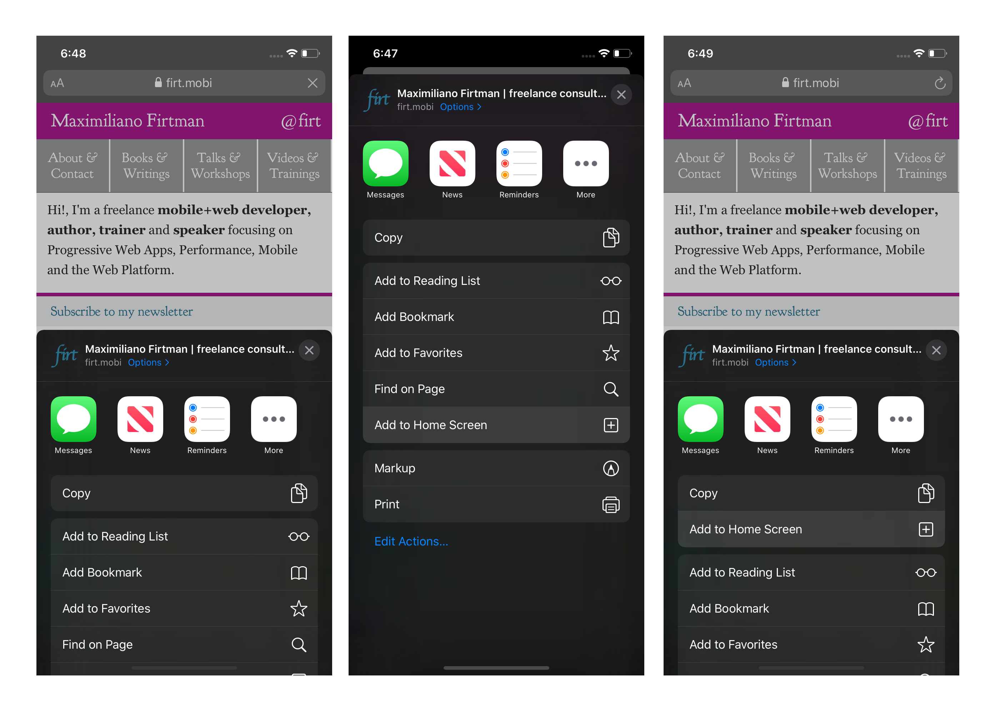
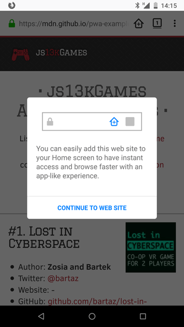
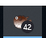
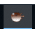

# The Web is on :fire: FIRE :fire: <!-- omit in toc -->

> **:construction: WIP :construction:**
>
> Since I rarely have the time to proofread these notes, their quality isn't as high as I would like, especially with regards to phrasing and syntax.
>
> Yet, I intend to use them as a foundation for some better content (blog posts especially) I'll write in the near future.
>
> :wave:**You can easily help me** work faster, if you're are impatient to read them.
> [**Open an issue**](https://github.com/noelmace/slides-wof-conf/issues/new)
> telling me what you think is missing in this document.
> Or, even better, [**send me a PR**](https://github.com/noelmace/slides-wof-conf/edit/master/src/notes.md), even if it only fixes a typo :wink:

## Table des matières

- [Table des matières](#table-des-mati%c3%a8res)
- [Introduction: PWA vs FIRE](#introduction-pwa-vs-fire)
  - [resources](#resources)
- [FIRE basis](#fire-basis)
  - [Fast: App Shell](#fast-app-shell)
  - [Integrated: Manifest & a2hs](#integrated-manifest--a2hs)
    - [Firefox Desktop](#firefox-desktop)
  - [Safari](#safari)
  - [resources](#resources-1)
  - [Reliable: Service Worker](#reliable-service-worker)
  - [Engaging: Push Notifications](#engaging-push-notifications)
- [How the Web evolves](#how-the-web-evolves)
  - [Standardization authorities](#standardization-authorities)
    - [W3C](#w3c)
      - [How it works](#how-it-works)
    - [WHATWG](#whatwg)
      - [Why it was created](#why-it-was-created)
      - [How it works](#how-it-works-1)
      - [Contribute](#contribute)
      - [Tracking](#tracking)
    - [WICG](#wicg)
      - [Tracking](#tracking-1)
      - [Contribute](#contribute-1)
    - [TC39](#tc39)
      - [How it works](#how-it-works-2)
      - [Contribute](#contribute-2)
  - [Integrators](#integrators)
    - [Chrome](#chrome)
    - [Mozilla](#mozilla)
  - [Remaining controversies](#remaining-controversies)
    - [EME](#eme)
      - [Adoption](#adoption)
      - [Opposition](#opposition)
- [An integrated Web](#an-integrated-web)
  - [PWA Install UX](#pwa-install-ux)
    - [in Chrome](#in-chrome)
      - [mini-infobar](#mini-infobar)
      - [omnibox install icon](#omnibox-install-icon)
    - [in Firefox Mobile](#in-firefox-mobile)
      - [Firefox info banner](#firefox-info-banner)
  - [Closing the _App Gap_](#closing-the-app-gap)
    - [Web Share Target API](#web-share-target-api)
      - [Manifest](#manifest)
      - [handling the incoming content](#handling-the-incoming-content)
      - [Level 2](#level-2)
      - [Support](#support)
      - [resources](#resources-2)
    - [Async Clipboard API (images)](#async-clipboard-api-images)
      - [Support](#support-1)
      - [resources](#resources-3)
    - [Badging API](#badging-api)
      - [resources](#resources-4)
    - [Shape Detection API](#shape-detection-api)
      - [face detection](#face-detection)
      - [barecode detection](#barecode-detection)
      - [text detection](#text-detection)
      - [support](#support-2)
      - [resources](#resources-5)
    - [Contacts Picker API](#contacts-picker-api)
      - [Support](#support-3)
      - [resources](#resources-6)
    - [And more...](#and-more)
- [A modular Web](#a-modular-web)
  - [Import Maps & built-in modules](#import-maps--built-in-modules)
  - [HTML Elements provided as build-in modules](#html-elements-provided-as-build-in-modules)
    - [experiments in progress](#experiments-in-progress)
- [An adaptive Web](#an-adaptive-web)
  - [Media Queries Level 5](#media-queries-level-5)
    - [Dark/Light Mode](#darklight-mode)
      - [Emulation / DevTools](#emulation--devtools)
        - [Chrome](#chrome-1)
        - [Puppeeteer](#puppeeteer)
        - [Firefox](#firefox)
    - [Reduced Motion](#reduced-motion)
    - [misc](#misc)
- [A more efficient Web](#a-more-efficient-web)
- [Misc](#misc-1)
## Introduction: PWA vs FIRE

Since the first list of what Progressive Web Apps (aka PWA) are [Alex Russel](https://infrequently.org/about-me/)
introduced in his now famous blog post,
[Progressive Web Apps:
Escaping Tabs Without Losing Our Soul](https://infrequently.org/2015/06/progressive-apps-escaping-tabs-without-losing-our-soul/),
was to complicated to remember (see below), those where quickly reduced to just 4, and then 3 principles and technologies.

> On Google Developers, when the PWA home page was created [in December 2015](https://web.archive.org/web/20151218101024/https://developers.google.com/web/progressive-web-apps/),
> it included this long list of "what PWAs are" from Alex Russel's blog post:
>
> - Progressive - Work for every user, regardless of browser choice because they’re built with progressive enhancement as a core tenet.
> - Responsive - Fit any form factor: desktop, mobile, tablet, or whatever is next.
> - Connectivity independent - Enhanced with service workers to work offline or on low quality networks.
> - App-like - Feel like an app to the user with app-style interactions and navigation because it's built on the app shell model.
> - Fresh - Always up-to-date thanks to the service worker update process.
> - Safe - Served via HTTPS to prevent snooping and ensure content hasn’t been tampered with.
> - Discoverable - Are identifiable as “applications” thanks to W3C manifests and service worker registration scope allowing search engines to find them.
> - Re-engageable - Make re-engagement easy through features like push notifications.
Installable - Allow users to “keep” apps they find most useful on their home screen without the hassle of an app store.
> - Linkable - Easily share via URL and not require complex installation.

These 4 topics were (and still are):

- the App Shell approach, for better [First Miningful Paint](https://developers.google.com/web/tools/lighthouse/audits/first-meaningful-paint) score
- Web App Manifests, for [a2hs](https://developer.mozilla.org/en-US/docs/Web/Progressive_web_apps/Add_to_home_screen) & discoverability
- Service Workers, for network reliability
- Push Notifications, for re-engagement

In order to help people remember those four topics, Google used for some times the acronym "FIRE" as a mnemonic of the
4 pillars of PWAs and Web Apps quality (check out, for example, the [PWA Roadshow playlist on Youtube](https://www.youtube.com/playlist?list=PLNYkxOF6rcICnIOm4cfylT0-cEfytBtYt)).

> FIRE stand for:
>
> 1. Fast
> 2. Integrated
> 3. Reliable
> 4. Engaging

This helped advocate for a wider range of technologies and methods.

Today, most people from the Chrome Team still use "PWA" as a synonym of "Quality/Good Web App".
But due to the simplification I talked about previously, this isn't what most people think when they hear "PWA".

PWAs tends to be confused with "Installable Web Apps", reducing it to a2hs only.

Now, there is two ways to look at PWAs:

1. from a "Business" perspective, they are a good alternative to native apps
2. from a developer perspective, making a Web App "Progressive" means raising the quality level for users,
using the latests innovations of the Web Platform

For all these reasons, I now prefer to make a clear distinction between those two perspectives,
using respectively "PWA" and "FIRE app" to talk about them.

### resources

- [Progressive Web Apps on MDN](https://developer.mozilla.org/en-US/docs/Web/Progressive_web_apps)
- [Google Codelab - Your First Progressive Web App](https://codelabs.developers.google.com/codelabs/your-first-pwapp/#0)
- [PWA Training Videos by Google Chrome Developers](https://www.youtube.com/playlist?list=PLNYkxOF6rcIB2xHBZ7opgc2Mv009X87Hh)

## FIRE basis

### Fast: App Shell

- [The App Shell Model](https://developers.google.com/web/fundamentals/architecture/app-shell)

### Integrated: Manifest & a2hs

Web App Manifest and a2hs are well supported by Firefox Mobile,
and by Edge Beta 78 (aka [Edgium](https://www.microsoftedgeinsider.com/en-us/), apparently [soon to be released as stable](https://techdows.com/2019/10/seems-microsofts-chromium-based-edge-stable-release-is-around-the-corner.html)) and Chrome on all there supported OS.

#### Firefox Desktop

A2HS isn't yet supported by Firefox Desktop, but mozillians are working on it.
The related Meta Issue priority has been recently (october 10, 19) set to P3, meaning it was
[added to the backlog](https://mozilla.github.io/bug-handling/triage-bugzilla).

The [--app option](https://bugzilla.mozilla.org/show_bug.cgi?id=1283670),
permitting to run web applications in "app mode" and therefor blocking the Meta issue,
isn't prioritized, even if it was created two years ago.

Yet, [Dave Townsend (aka Mossop)](https://mozillians.org/en-US/u/Mossop/),
the lead architect for Firefox front-end,
[commented in september](https://bugzilla.mozilla.org/show_bug.cgi?id=1283670#c58):

> "We're in the process of planning out a feature similar to this.
> We likely wouldn't accept a patch here until we're done with the current investigations
> (mostly at the research stage right now)."

### Safari

Well, with Apple, it's a different kettle of fish.

> **TL;DR:**
>
> Pretty much everything about PWA in Safari is about finding the right workaround.
> There even are some kind of weird libraries for that, like [a2hs.js](https://github.com/koddr/a2hs.js) for example.

It's now the only browser builder who rejects the usage of the term
(they prefer ["HTML5 apps" apparently](https://developer.apple.com/news/?id=09062019b) 🤷‍♂).

> Safari was even [the latest](https://caniuse.com/#feat=serviceworkers) major browser to support service worker (the freaking March 29, 2018, more than 3 years after Chrome, Firefox and Opera, with [Safari 11.1](https://github.com/mdn/browser-compat-data/pull/1881) & [iOS 11.3](https://github.com/mdn/browser-compat-data/pull/4835))!

Apple is constantly making the a2hs related UX a nightmare (see the capture below) while
[rejecting "HTML 5 apps" from the AppStore](https://developer.apple.com/app-store/review/guidelines/#third-party-software).
And most related features are undocumented.



All of this makes
[some people](https://stackoverflow.com/questions/51160348/pwa-how-to-programmatically-trigger-add-to-homescreen-on-ios-safari#comment89306055_51160938)
suspicious about this strategy being driven by fear of loosing money,
against all Safari (or even iOS) user interest.

Currently, the best resources to dive into this issues are written
by [Maximiliano Flirtman](https://medium.com/@firt).
Go check [its last blog post](https://medium.com/@firt/iphone-11-ipados-and-ios-13-for-pwas-and-web-development-5d5d9071cc49)
about this, in which he goes in details into PWA & web dev limitations in iOS 13 & iPadOS.

### resources

- [MDN - Add to Home Screen](https://developer.mozilla.org/en-US/docs/Web/Progressive_web_apps/Add_to_home_screen)
- [Web Fundamentals - Add to Home Screen](https://developers.google.com/web/fundamentals/app-install-banners)
- [Web App Manifest W3C Living Document](https://w3c.github.io/manifest/)

### Reliable: Service Worker

- [browser support](https://caniuse.com/#feat=serviceworkers)
- [Service Workers: an Introduction](https://developers.google.com/web/fundamentals/primers/service-workers)
- [MDN - Using Service Workers](https://developer.mozilla.org/en-US/docs/Web/API/Service_Worker_API/Using_Service_Workers)
- [MDN - Service Worker API](https://developer.mozilla.org/en-US/docs/Web/API/Service_Worker_API)
- [Service Workers WD](https://www.w3.org/TR/service-workers/)

### Engaging: Push Notifications

- [browser support](https://caniuse.com/#feat=push-api)
- [safari push notifications](https://developer.apple.com/notifications/safari-push-notifications/) :man_facepalming:
- [Web Push Notifications: Timely, Relevant, and Precise](https://developers.google.com/web/fundamentals/push-notifications/)
- [How Push Works](https://developers.google.com/web/fundamentals/push-notifications/how-push-works)
- [Push API WD](https://www.w3.org/TR/push-api/)
- [Notifications API Living Standard](https://notifications.spec.whatwg.org/)

## How the Web evolves

Standardization process, involving standardization authorities and integrators (i.e. Web Browsers builders).

### Standardization authorities

#### W3C

> World Wide Web Consortium - [w3.org](https://www.w3.org/)

- https://github.com/w3ctag/design-reviews
- https://github.com/w3ctag/meetings

##### How it works

- https://www.w3.org/2019/Process-20190301/#Organization
- https://www.w3.org/Consortium/fees
- https://www.w3.org/community/
- https://www.w3.org/wiki/Evergreen_Standards

#### WHATWG

> Web Hypertext Application Technology Working Group - [whatwg.org](https://whatwg.org/)

##### Why it was created

- [HTML living standard - History](https://html.spec.whatwg.org/multipage/introduction.html#history-2)
- [XHTML™ 2.0 - introduction](https://www.w3.org/TR/2010/NOTE-xhtml2-20101216/introduction.html#s_intro)
- [XForms archive on MDN](https://developer.mozilla.org/en-US/docs/Archive/Web/XForms)

##### How it works

- [FAQ](https://whatwg.org/faq)
- [Working Mode](https://whatwg.org/working-mode)
- [Workstream Policy](https://whatwg.org/workstream-policy)
- [Participate](https://github.com/whatwg/participate.whatwg.org)
- [HTML Standard Contributor Guidelines](https://github.com/whatwg/html/blob/master/CONTRIBUTING.md)
- [Contributor Guidelines](https://github.com/whatwg/meta/blob/master/CONTRIBUTING.md)

Since May 2019, the [war is over](https://www.theregister.co.uk/2019/05/29/w3c_whatwg_working_on_one_html_dom_spec/)
between the W3C and WHATWG!

##### Contribute

:octocat: On Github:

- [HTML standard](https://github.com/whatwg/html)
- [DOM standard](https://github.com/whatwg/dom)

##### Tracking

- [New Features Awaiting Implementation Interest](https://wiki.whatwg.org/wiki/New_Features_Awaiting_Implementation_Interest)

#### WICG

> Web Incubator Community Group - [wicg.io](https://wicg.io/)

July 2015: [Launch announcement](https://www.w3.org/blog/2015/07/wicg/)

##### Tracking

- [Proposals Tracking](https://docs.google.com/spreadsheets/d/1K2EtkvKXMDk_h2goR34uMIWmw1LfPhIi-QAJHcQBP_4/edit?usp=sharing)

##### Contribute

- :octocat:https://github.com/WICG
- :speaking_head: https://discourse.wicg.io/

#### TC39

> Ecma International, Technical Committee 39 - ECMAScript - [tc39.es](https://tc39.es/)

##### How it works

- [Process](https://tc39.es/process-document/)
- [Test 262](https://github.com/tc39/test262)

##### Contribute

:octocat: On Github

- [TC39 org](https://github.com/tc39)
- [proposals](https://github.com/tc39/proposals)

### Integrators

#### Chrome

- Chrome Status: [in development](https://chromestatus.com/features#browsers.chrome.status%3A%22In%20development%22)
- Google Developers, Web: [Updates](https://developers.google.com/web/updates/)
- [Origin Trials](https://github.com/GoogleChrome/OriginTrials/blob/gh-pages/README.md)

#### Mozilla

- :octocat: [mozilla/standards-positions](https://github.com/mozilla/standards-positions): Mozilla's Positions on Emerging Web Specifications
- :bug: https://bugzilla.mozilla.org/describecomponents.cgi
- :twisted_rightwards_arrows: https://wiki.mozilla.org/Platform/Roadmap
- :writing_hand: https://hacks.mozilla.org/

### Remaining controversies

#### EME

- [Encrypted Media Extensions Standard](https://w3c.github.io/encrypted-media/)
- [What is EME?](https://developers.google.com/web/fundamentals/media/eme)

##### Adoption

Youtube & Netflix quickly adopted EME, while moving away from, respectively, Flash and Silverlight.

Regarding Youtube, we can simply notice that the "Embed a playlist" documentation still gives today the following example:

```html
<iframe width="560" height="315" src="https://www.youtube.com/embed/videoseries?list=PLx0sYbCqOb8TBPRdmBHs5Iftvv9TPboYG" frameborder="0" allow="autoplay; encrypted-media" allowfullscreen></iframe>
```

Where [encrypted-media](https://developer.mozilla.org/en-US/docs/Web/HTTP/Headers/Feature-Policy/encrypted-media)
is explicitly allowed in this iframe feature policy.

On that topic, read [Why YouTube & Netflix use MPEG-DASH in HTML5](https://bitmovin.com/status-mpeg-dash-today-youtube-netflix-use-html5-beyond/) and [HTML5 video at Netflix](https://medium.com/netflix-techblog/html5-video-at-netflix-721d1f143979).

##### Opposition

From the very beginning, EME faced strong criticism from representatives from Mozilla. Here are some example messages:

- [from Boris Zbarsky](https://lists.w3.org/Archives/Public/public-html/2012Feb/0352.html)
- [from Ian Hickson](https://lists.w3.org/Archives/Public/public-html/2012Feb/0274.html)

It even caused some [protests](https://www.vice.com/en_us/article/jpgpjx/we-marched-with-richard-stallman-at-a-drm-protest-last-night-w3-consortium-MIT-joi-ito),
led by Richard Stallman and the FSF.

After its standardization, the [EFF Announced its resignation from W3C](https://www.eff.org/deeplinks/2017/09/open-letter-w3c-director-ceo-team-and-membership).

## An integrated Web

- [Patterns for Promoting PWA Installation (mobile)](https://developers.google.com/web/fundamentals/app-install-banners/promoting-install-mobile)
  - June 2019: [news](https://developers.google.com/web/updates/2019/06/pwa-install-patterns)

### PWA Install UX

#### in Chrome

- Initial Proposals (2015)
  - [slightlyoff/AppInstallImprovements](https://github.com/slightlyoff/AppInstallImprovements)
  - https://chromestatus.com/features/4540065577435136

##### mini-infobar


> « The mini-infobar is an interim experience that becomes annoying (the number of PWAs is growing).
> Starting in Chrome 76, it's possible to prevent the mini-infobar from appearing by calling `preventDefault()`
> on the `beforeinstallprompt` event (see [2019/05 mini-infobar-update](https://developers.google.com/web/updates/2019/05/mini-infobar-update)),
> but according to our observations very few developers do it. »
>
> — [Issue 988301, comment 1](https://bugs.chromium.org/p/chromium/issues/detail?id=988301#c1)

##### omnibox install icon


- [Issue 988301: PWA install icon in the omnibox for Android](https://bugs.chromium.org/p/chromium/issues/detail?id=988301&q=mini-infobar&colspec=ID%20Pri%20M%20Stars%20ReleaseBlock%20Component%20Status%20Owner%20Summary%20OS%20Modified)
- PWA install icon in the omnibox for desktop:
  - [Issue 907351: Surface PWA installation in the omnibox](https://bugs.chromium.org/p/chromium/issues/detail?id=907351)
  - [Annoucement](https://developers.google.com/web/updates/2019/06/pwa-install-addressbar)

#### in Firefox Mobile

MDN:

- https://developer.mozilla.org/en-US/docs/Web/Progressive_web_apps/Installable_PWAs
- https://developer.mozilla.org/en-US/docs/Web/Progressive_web_apps/Add_to_home_screen

##### Firefox info banner

Only shows once!



### Closing the _App Gap_

Chrome: [Unlocking new capabilities for the web](https://developers.google.com/web/updates/capabilities)

- [API Tracker](https://docs.google.com/spreadsheets/d/1de0ZYDOcafNXXwMcg4EZhT0346QM-QFvZfoD8ZffHeA/edit?usp=sharing)
- [proj-fugu issues](https://bugs.chromium.org/p/chromium/issues/list?q=proj-fugu)
- [Codelab](https://codelabs.developers.google.com/codelabs/web-capabilities/)

#### Web Share Target API

> :rocket: _Launched Capability_

> :warning: Should not be confused with the [Web Share API](https://caniuse.com/#feat=web-share),
> which permits to share data **from** a web page, as follow:
>
> ```js
> navigator.share({title: 'Example Page', url: 'https://example.com'});
> ```

##### Manifest

```json
{
  "name": "Web Share Target Test App",
  [...]
  "share_target": {
    "action": "sharetarget.html",
    "params": {
      "title": "title",
      "text": "text",
      "url": "url"
    }
  },
  [...]
}
```

##### handling the incoming content

Data is passed using get param.

`?title=hello&text=world`

```js
window.addEventListener('DOMContentLoaded', () => {
  const parsedUrl = new URL(window.location);
  // searchParams.get() will properly handle decoding the values.
  console.log('Title shared: ' + parsedUrl.searchParams.get('title'));
  console.log('Text shared: ' + parsedUrl.searchParams.get('text'));
  console.log('URL shared: ' + parsedUrl.searchParams.get('url'));
});
```

##### Level 2

Permits to share/receive images.

<!-- TODO -->

- [Web Share - draft CG](https://w3c.github.io/web-share/level-2/)
- [Target - draft CG](https://wicg.github.io/web-share-target/level-2/)

##### Support

> The Web Share API itself is only supported by Chrome Android and ... Safari :tada: (see [caniuse](https://caniuse.com/#feat=web-share)).
>
> :heavy_plus_sign: Firefox 72 should support the Web Share API too
> (see :beetle: [1402369](https://bugzilla.mozilla.org/show_bug.cgi?id=1402369) & [1312422](https://bugzilla.mozilla.org/show_bug.cgi?id=1312422)).
> Yet, Firefox Nightly doesn't for now (tested on 72.0a1 (2019-10-30), see Fenix [#328](https://github.com/mozilla-mobile/fenix/issues/328), [android-components #3486](https://github.com/mozilla-mobile/android-components/issues/3486), [780](https://github.com/mozilla-mobile/fenix/issues/780)).

Level 1 is only supported by Chrome 71+.

Mozilla expressed its support ([#176](https://github.com/mozilla/standards-positions/issues/176) & [PR#183](https://github.com/mozilla/standards-positions/pull/183)) and prioritized the related issues (Fenix [#4637](https://github.com/mozilla-mobile/android-components/issues/4637), [#5783](https://github.com/mozilla-mobile/fenix/issues/5783) & :beetle: [1476515](https://bugzilla.mozilla.org/show_bug.cgi?id=1476515)).

Level 2 is supported by Chrome for Android 76 (see [status](https://www.chromestatus.com/features/6124071381106688)), while the Web Share API level 2 is supported by Chrome for Android 75+ (see [status](https://www.chromestatus.com/feature/4777349178458112)).

##### resources

- [Registering as a Share Target with the Web Share Target API](https://developers.google.com/web/updates/2018/12/web-share-target)
- [codelab](https://codelabs.developers.google.com/codelabs/web-capabilities/#3)
- [MDN - navigator.share](https://developer.mozilla.org/en-US/docs/Web/API/Navigator/share)
- [Mozilla public support](https://github.com/mozilla/standards-positions/issues/27)

#### Async Clipboard API (images)

> :rocket: _Launched Capability (Chrome 76)_

```js
/** Write contents of the textarea to the clipboard when clicking "Copy" */
copy.onclick = async () => {
  await navigator.clipboard.writeText(out.value)
};

/** Read from clipboard when clicking the Paste button */
paste.onclick = async () => {
  const text = await navigator.clipboard.readText()
  return text;
};
```

Now:

```js
/** Write the Chrome logo to the clipboard when clicking "Copy" */
copy.onclick = async () => {
try {
  const imgURL = '/images/generic/file.png';
  const data = await fetch(imgURL);
  const blob = await data.blob();
  await navigator.clipboard.write([
    new ClipboardItem(Object.defineProperty({}, blob.type, {
      value: blob,
      enumerable: true
    }))
  ]);
  console.log('Image copied.');
} catch(e) {
  console.error(e, e.message);
}

/** Read from clipboard when clicking the Paste button */
paste.onclick = async () => {
  try {
    const clipboardItems = await navigator.clipboard.read();
    const blobOutput = await clipboardItems[0].getType('image/png');
    document.getElementById('image-field').src =
      window.URL.createObjectURL(blobOutput);
  } catch(e) {
    log('Failed to read clipboard');
  }
};

/** Watch for pastes */
navigator.clipboard.addEventListener('clipboardchange', async e => {
  const text = await navigator.clipboard.getText();
  log('Updated clipboard contents: '+text)
});
```

##### Support

The clipboard API is (partially) supported by [Chome 66+](https://www.chromestatus.com/feature/5861289330999296),
Firefox63+ and Opera 53+.

However:

- the async part is supported by
  - Chrome 66+
  - Firefox 63+ behind the `dom.events.asyncClipboard.dataTransfer` flag, but there is still some issues (see the Mozilla Standards Positions about this in [89](https://github.com/mozilla/standards-positions/issues/89) & [206](https://github.com/mozilla/standards-positions/issues/206))
- this is because there is still some ongoing discussions about this [in W3C TAG](https://github.com/w3ctag/design-reviews/issues/406)
- the support for images (what we're talking about here) was added by [Chrome 76](https://www.chromestatus.com/features/5074658793619456).

##### resources

- [Image support for the async clipboard API](https://web.dev/image-support-for-async-clipboard/)
- [MDN - Clipboard API]()
- [codelab](https://codelabs.developers.google.com/codelabs/web-capabilities/#6)
- [Demo](https://fiddle.jshell.net/0794oysr/2/show/light/)
- [Related chapter in the Cliboard API Draft](https://www.w3.org/TR/clipboard-apis/#async-clipboard-api)

#### Badging API

:warning: Only available in Chrome, behind `#enable-experimental-web-platform-features`, on Windows and macOS.

> No GNU/Linux nor ChromeOS support here. This is why I need to use a Windows VM for that :man_shrugging:.

A new shape for this API [was decided in september](https://github.com/WICG/badging/issues/55), and added to Chrome in Oct '19, but not released in Canary yet (see [comment](https://bugs.chromium.org/p/chromium/issues/detail?id=719176#c87)) and the specs [are behing updated](https://github.com/WICG/badging/issues/45).

```js
navigator.setAppBadge(42);
navigator.setExperimentalAppBadge(42);
navigator.setClientBadge(42, { client });
```



```js
navigator.clearAppBadge();
navigator.clearExperimentalAppBadge();
navigator.clearClientBadge();
```



##### resources

- [W3C - Draft CG](https://wicg.github.io/badging/)
- [WICG repo](https://github.com/WICG/badging)
- [Web.dev post](https://web.dev/badging-api/)
- [Codelab](https://codelabs.developers.google.com/codelabs/web-capabilities/#1)
- Demos: [Badging API Demi](https://badging-api.glitch.me/), [Google - AirHorn](https://github.com/GoogleChromeLabs/airhorn/blob/master/app/scripts/main.min.js)

#### Shape Detection API

##### face detection

```js
const faceDetector = new FaceDetector({
  // (Optional) Hint to try and limit the amount of detected faces
  // on the scene to this maximum number.
  maxDetectedFaces: 5,
  // (Optional) Hint to try and prioritize speed over accuracy
  // by, e.g., operating on a reduced scale or looking for large features.
  fastMode: false
});
try {
  const faces = await faceDetector.detect(image);
  faces.forEach(face => drawMustache(face));
} catch (e) {
  console.error('Face detection failed:', e);
}
```

##### barecode detection

```js
const barcodeDetector = new BarcodeDetector({
  // (Optional) A series of barcode formats to search for.
  // Not all formats may be supported on all platforms
  formats: [
    'aztec',
    'code_128',
    'code_39',
    'code_93',
    'codabar',
    'data_matrix',
    'ean_13',
    'ean_8',
    'itf',
    'pdf417',
    'qr_code',
    'upc_a',
    'upc_e'
  ]
});
try {
  const barcodes = await barcodeDetector.detect(image);
  barcodes.forEach(barcode => searchProductDatabase(barcode));
} catch (e) {
  console.error('Barcode detection failed:', e);
}
```

##### text detection

```js
const textDetector = new TextDetector();
try {
  const texts = await textDetector.detect(image);
  texts.forEach(text => textToSpeech(text));
} catch (e) {
  console.error('Text detection failed:', e);
}
```

##### support

This API ***highly*** depends on hardware acceleration, and most devices doesn't support it for now.
Using it on some devices could give you some better performances. Yet, you should absolutely add a fallback (see "Best Practices" below).
Due to a combination of hardware (old computers, notebooks & Samsung Galaxy S8)
and software (ArchLinux being the only host OS I have on my Dell XPS) limitations, I myself wasn't able to use this API yet.

[Chrome Status](https://www.chromestatus.com/feature/4757990523535360)
> Support for this API is dependant on hardware acceleration features that vary by operating system.
>
> - BarcodeDetector: Android\*, macOS (improved accuracy in 10.13+)
> - FaceDetector: Android, macOS (improved accuracy in 10.13+), Windows 10
> - TextDetector: Android\*, macOS 10.11+, Windows 10
>
> \* Requires a device with the Play support libraries installed.

[Best Practices](https://web.dev/shape-detection/#bestpractices)
> **Caution**: This API is an optimization and not something guaranteed to be available from the platform for every user.
> Developers are expected to combine this with their own [image recognition code](https://github.com/mjyc/opencv) and
> take advantage of the native optimization when it is available.

_Here, the given example is [opencv.js](https://www.npmjs.com/package/opencv.js), but you could use any other vision & ML library, like
[face-api.js](https://github.com/justadudewhohacks/face-api.js/) for face detection for example._

##### resources

- [public explainer](https://docs.google.com/document/d/1QeCDBOoxkElAB0x7ZpM3VN3TQjS1ub1mejevd2Ik1gQ/edit)
- [a picture is worth a thousand words, faces, and barcodes](https://web.dev/shape-detection/)
- [Accelerated Shape Detection in Images - Draft CG](https://wicg.github.io/shape-detection-api/)
- [Codelab](https://codelabs.developers.google.com/codelabs/web-capabilities/#2)
- Demos: [glitch](https://shape-detection-demo.glitch.me/), [from codelab](https://codelab-face-detection.glitch.me/)

#### Contacts Picker API

> :warning: Unofficial Proposal Draft

```js
getContactsButton.addEventListener('click', async () => {
  const contacts = await navigator.contacts.select(
      ['name', 'email'],
      {multiple: true});
  if (!contacts.length) {
    // No contacts were selected, or picker couldn't be opened.
    return;
  }
  console.log(contacts);
});
```

##### Support

only on Chrome 77+ on Android M or later

- [Mozilla Position](https://github.com/mozilla/standards-positions/issues/153) - ongoing discussion

##### resources

- [A contact picker for the web](https://web.dev/contact-picker/)
- [codelab](https://codelabs.developers.google.com/codelabs/web-capabilities/#5)
- [Unofficial Proposal Draft](https://wicg.github.io/contact-api/spec/)
- [proposal repo](https://wicg.github.io/contact-api/spec/)

#### And more...

<!-- TODO -->

- Get Installed Related Apps
- Native File System
- Wake Lock API

## A modular Web

### Import Maps & built-in modules

Import Maps:

- https://wicg.github.io/import-maps/
- https://chromestatus.com/feature/5315286962012160
- https://github.com/mozilla/standards-positions/issues/146

Built-in modules:

- https://github.com/tc39/proposal-javascript-standard-library
- Stage 1 - last presented on [June 2019](https://github.com/tc39/tc39-notes/blob/master/meetings/2019-06/june-5.md#javascript-standard-library-for-stage-2--part-2-)

KV Storage:

- https://developers.google.com/web/updates/2019/03/kv-storage
- https://chromestatus.com/features/6428344899862528
- https://wicg.github.io/kv-storage/
- https://github.com/mozilla/standards-positions/issues/145

### HTML Elements provided as build-in modules

- whatwg/html: [Introducing new HTML elements that are pay-for-what-you-use #4697](https://github.com/whatwg/html/issues/4697)
- [Define Web IDL Modules](https://github.com/heycam/webidl/pull/675)

see also:

- https://github.com/drufball/layered-apis ([chrome status](https://www.chromestatus.com/features/6555299569729536))

#### experiments in progress

- https://github.com/WICG/virtual-scroller ([demos](https://github.com/fergald/virtual-scroller-demos) - [Chrome Status](https://www.chromestatus.com/feature/5673195159945216))
- https://github.com/jackbsteinberg/std-toast ([TAG Review](https://github.com/w3ctag/design-reviews/issues/385) - [Chrome Status](https://www.chromestatus.com/feature/5674896879255552))
- https://github.com/tkent-google/std-switch/ ([TAG Review](https://github.com/w3ctag/design-reviews/issues/384) - [Chrome Status](https://www.chromestatus.com/feature/6624580116414464))

- see also
  - https://github.com/WICG/display-locking

## An adaptive Web

### Media Queries Level 5

- https://developer.mozilla.org/en-US/docs/Web/CSS/Media_Queries/Using_media_queries
- https://drafts.csswg.org/mediaqueries-5/

#### Dark/Light Mode

Read [_Hello darkness my old friend_](https://web.dev/prefers-color-scheme) by Thomas Steiner on Web.dev.

- prefers-color-scheme ([MDN](https://developer.mozilla.org/en-US/docs/Web/CSS/@media/prefers-color-scheme))
- [color-scheme](https://medium.com/dev-channel/what-does-dark-modes-supported-color-schemes-actually-do-69c2eacdfa1d) ([csswg draft](https://drafts.csswg.org/css-color-adjust-1/#propdef-color-scheme), [Chrome Status](https://chromestatus.com/feature/5330651267989504))

##### Emulation / DevTools

###### Chrome
[Issue 977243: DevTool helper for prefers-color-scheme: dark](https://bugs.chromium.org/p/chromium/issues/detail?id=977243)

###### Puppeeteer

[feat: emulate prefers-color-scheme #4906](https://github.com/GoogleChrome/puppeteer/issues/4906)

###### Firefox

_from [stackoverflow](https://stackoverflow.com/questions/56401662/firefox-how-to-test-prefers-color-scheme):_
1. open about:config
2. add a ui.systemUsesDarkTheme integer entry set to 1
3. restart firefox

#### Reduced Motion

[Move Ya! Or maybe, don't, if the user prefers-reduced-motion!](https://developers.google.com/web/updates/2019/03/prefers-reduced-motion)

[MDN](https://developer.mozilla.org/fr/docs/Web/CSS/@media/prefers-reduced-motion)

#### misc

- https://developer.mozilla.org/en-US/docs/Web/CSS/@media/prefers-reduced-transparency
- https://developer.mozilla.org/en-US/docs/Web/CSS/@media/prefers-contrast
- https://developer.mozilla.org/en-US/docs/Web/CSS/@media/prefers-color-scheme
- https://developer.mozilla.org/en-US/docs/Web/CSS/@media/scripting
- https://developer.mozilla.org/en-US/docs/Web/CSS/@media/light-level
- https://developer.mozilla.org/en-US/docs/Web/CSS/@media/forced-colors

## A more efficient Web

- https://web.dev/native-lazy-loading/
- https://web.dev/load-faster-like-proxx/
- https://web.dev/preload-responsive-images/
- https://developers.google.com/web/updates/2019/08/get-started-with-gpu-compute-on-the-web

## Misc

- https://github.com/w3c/paint-timing
- https://github.com/whatwg/html/issues/3534
- https://web.dev/more-capable-form-controls/
